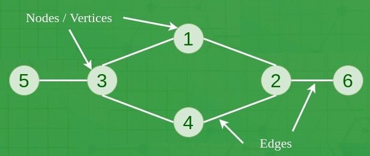
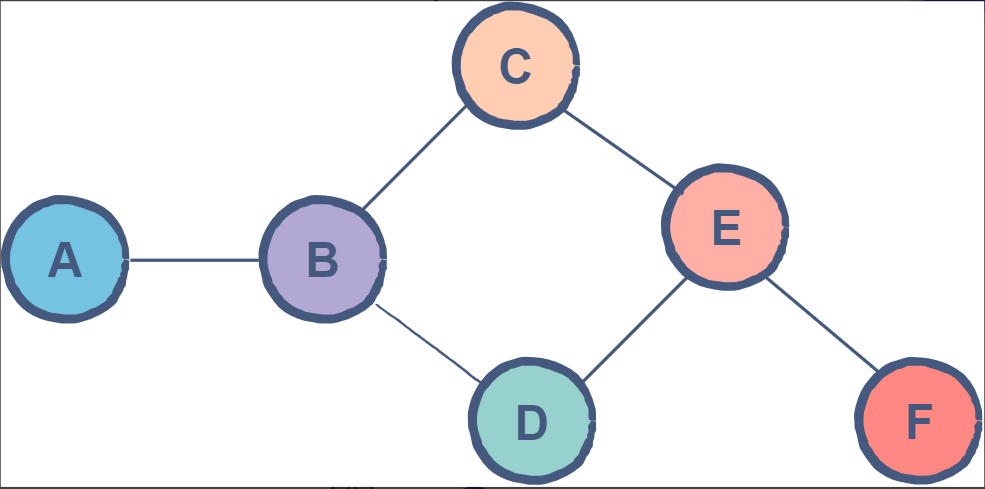
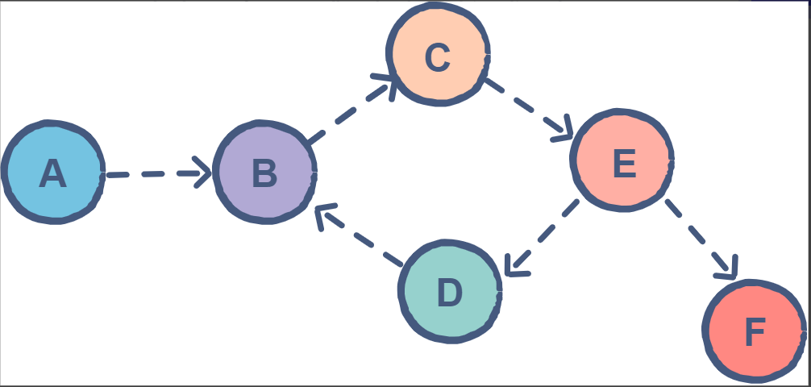
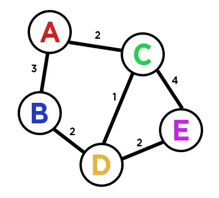
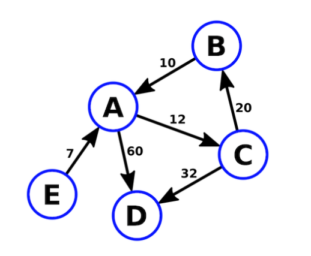

# Graph Algorithms In Java

> A Graph is a non-linear data structure consisting of vertices and edges. The vertices are sometimes also referred
> to as nodes and the edges are lines or arcs that connect any two nodes in the graph. More formally a Graph is composed of a set of vertices(V) and a set of edges(E).

## Table of contents

1. Graph Theory
2. Graph Implementation in Java
3. Graph Operations

_work_in_progress_

### Youtube

[Graph Algorithms in Java playlist](https://www.youtube.com/playlist?list=PLQDzPczdXrTixMffyeaHH0nZiul4dxMRQ)

---

### Chapter 01. Graph Theory

Graph is simply a collection of nodes with edges between them.

1. Undirected Graph

In an undirected graph the edges are bidirectional, with no direction associated with them. Hence, the graph can be
traversed in either direction. The absence of an arrow tells us that the graph is undirected.

2. Directed Graph

A directed graph is a set of vertices (nodes) connected by edges, with each node having a direction associated with it.

Edges are usually represented by arrows pointing in the direction the graph can be traversed.

3. Weighted Graphs

A graph in which the edges are specified with suitable weight is known as a weighted graph. The weights may represent
cost, distance and many other relative measuring units.

Weighted graphs can be further classified as:

- Undirected weighted graphs

- Directed weighted graphs

---

### Chapter 02. Graph Implementation in Java

There are two ways to store a graph:

- Adjacency Matrix
- Adjacency List

---

### Chapter 03. Graph Operations

Below are the basic operations on the graph:

- Insertion of Nodes/Edges in the graph – Insert a node into the graph
- Deletion of Nodes/Edges in the graph – Delete a node from the graph
- Searching on Graphs – Search an entity in the graph
- Traversal of Graphs – Traversing all the nodes in the graph
